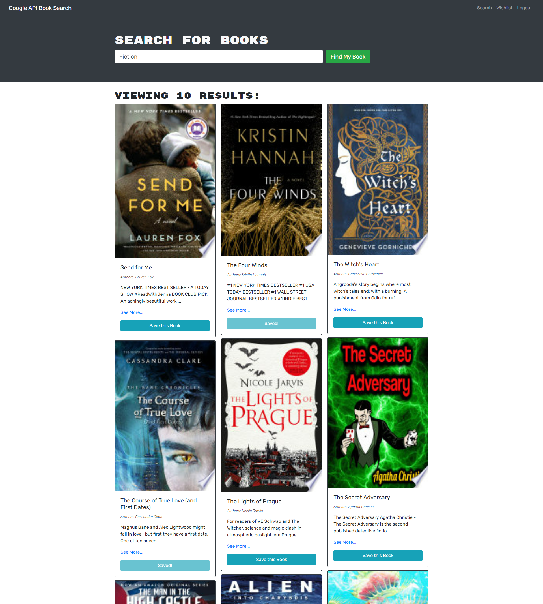

# Book Search Engine

## Table of Contents
* [Deployed](#deployed)
* [Description](#description)
* [Technologies](#technologies)
* [Usage](#usage)
* [Preview](#preview)
* [Questions](#questions)
* [Credits](#credits)

## Deployed
Access the website [here](https://afternoon-bayou-39192.herokuapp.com/)

## Description
This is a simple book search engine that uses Google's Books API to search books by title, author, genre, or keyword. You can use it to find a book and save books to your wishlist for later.

## Technologies
This application was built using the MERN stack:
* MongoDB
* Express.js
* React.js
* Node.js

With additional tools:
* Google Books API
* JavaScript
* GraphQL
* Mongoose
* bCrypt
* JSON Web Token
* Apollo Server Express
* Bootstrap

## Usage
This website can be used without logging in for view-only mode, but signing up for an account unlocks access to a feature that allows you to save books to a wishlist.

After logging in and finding your desired book, simply click the save button at the bottom of the book description.

You can view your wishlist on a separate page using the "Wishlist" link in the navigation bar. Once there, you will see a complete list of all of your saved books.

To remove a book from your wishlist, click the "Delete" button at the bottom of the book description and it will be removed from your list.

Use the top left navigation link to return to the homepage and select "Logout" when finished.

## Preview

## Questions
Have questions about this project?  
GitHub: https://github.com/sarawrmas  
Email: sara.m.adamski@gmail.com

## Credits
Sara Adamski  
Google Books API